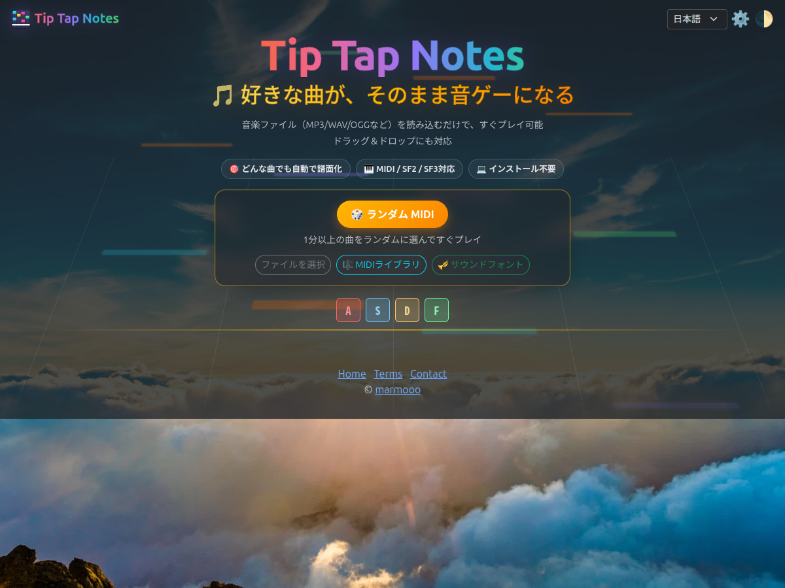
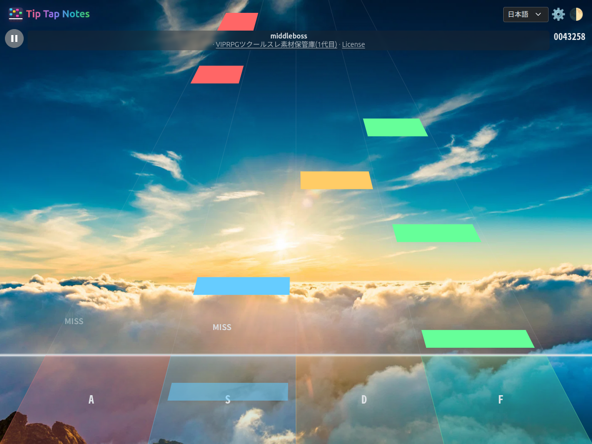
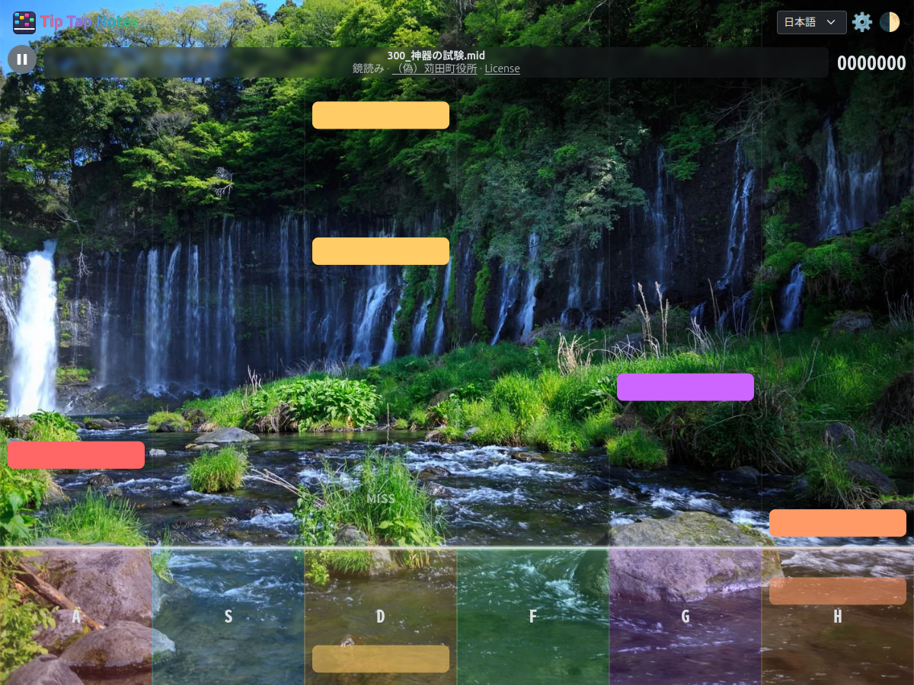
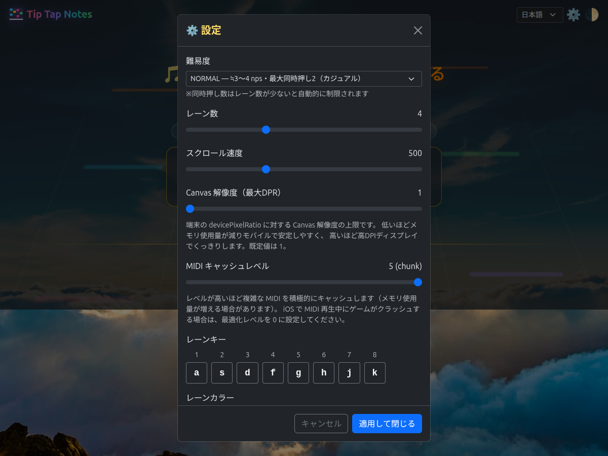
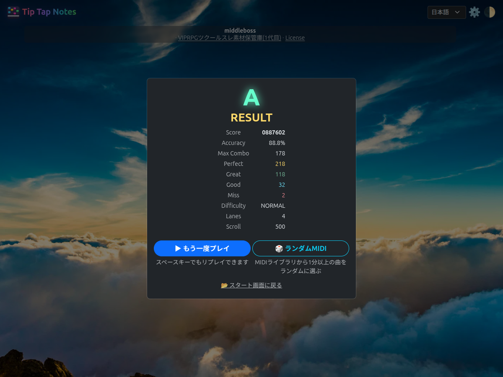
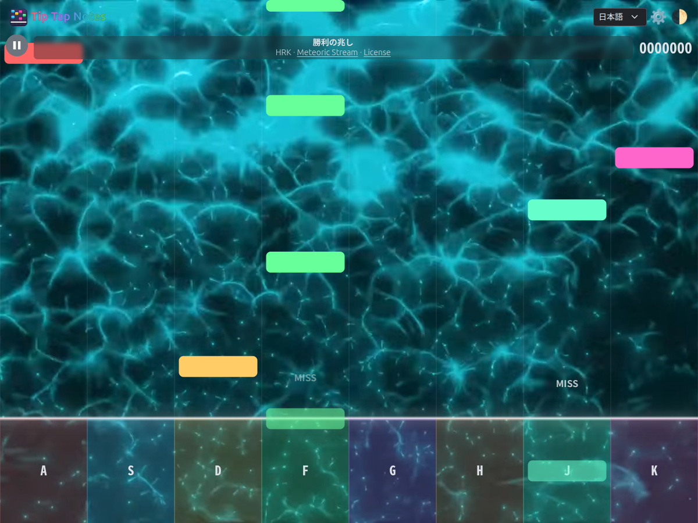
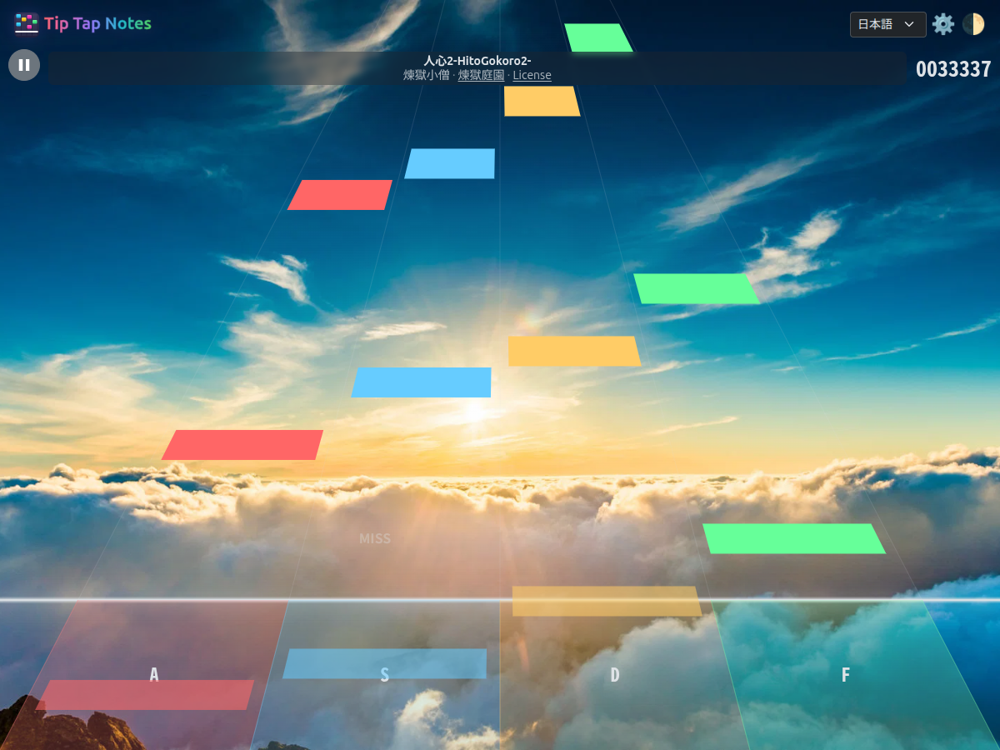

# Tip Tap Notes

A browser-based falling-note rhythm game that automatically generates charts
just by loading music files (MP3/WAV/OGG, etc.). Built around tap notes. You can
also play MIDI files directly and change the sound source using SoundFonts
(SF2/SF3).

[フリーゲーム夢現](https://freegame-mugen.jp/puzzle/game_15347.html)

[itch.io](https://marmooo-games.itch.io/tip-tap-notes)

## Screenshots

Title Screen 

Gameplay Screen - With Perspective


Gameplay Screen - Without Perspective


MIDI Library 

Settings Screen 

Score Screen 

Customization - Background


Customization - Notes/Lanes


Customization - Keys 

Customization - Difficulty/Speed


## Build

```
bash build.sh
```
